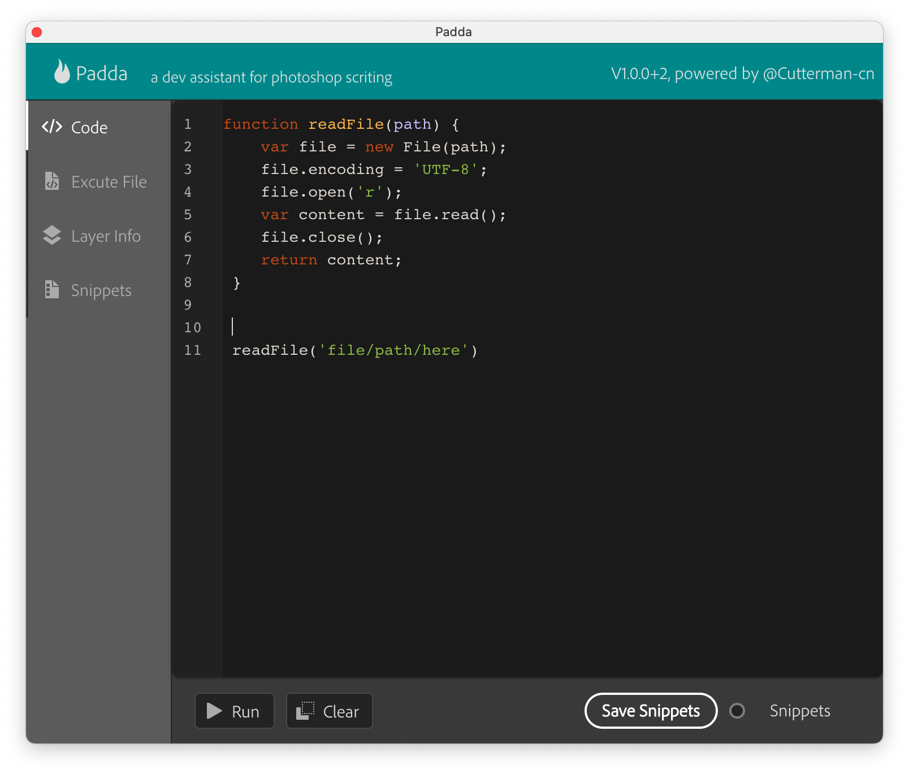

# Padda

Padda是一个可以在里面编写JSX脚本代码的插件

当我们在做Ps插件/脚本开发的时候，经常需要在PS里头测试某些代码能否正确运行，之前一般都用Adobe Extensions Toolkit这个工具，但是这个工具已经不再升级了，它目前在最新的Mac 64位系统上已经无法运行了，同时也经常遇到连不上Ps的情况。

所以，为了快速验证脚本效果，我写了这个小插件

## 功能特性

### 1. 编写代码

没错，你可以在插件面板中编写代码！

内置的代码编辑器，可以让你即时编写JSX脚本代码，也可以随手复制一段AM进去，然后点运行，即可看到结果输出。

编辑器支持代码高亮，自动缩进等

and when error occurs, you can see exception detail in the output field.

> notce: debug is not implemented!

### 2. execute local file

you can quickly execute a jsx file on disk, without using File -> Script -> Select...

### 3. Layer Info detect

when selected a layer, it shows the layer information in JSON format

### 4. Snippets

easy way to manage your code snippet, you can save your code and use in future.

## Usage

download latest release from [release page](https://github.com/cutterman-cn/padda/releases)

unzip the installer zip and double click to install

after installation complete, restart your photoshop and open the panel from Window -> Extensions -> Padda - devtool

