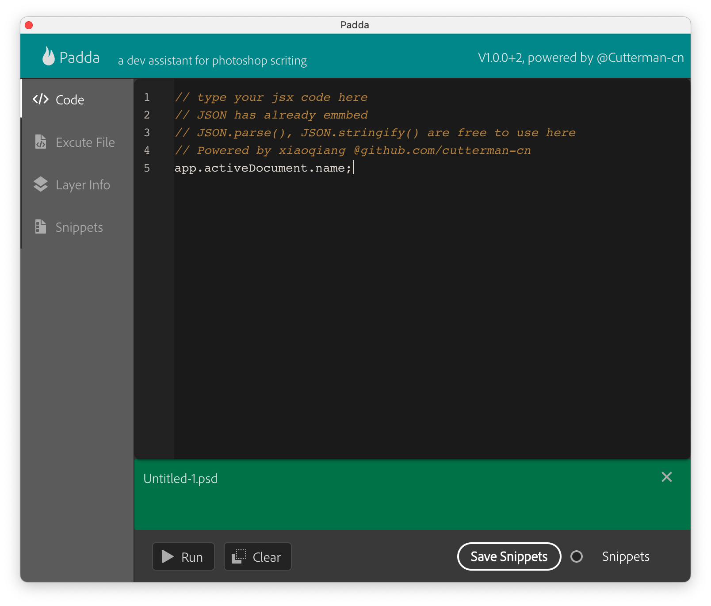
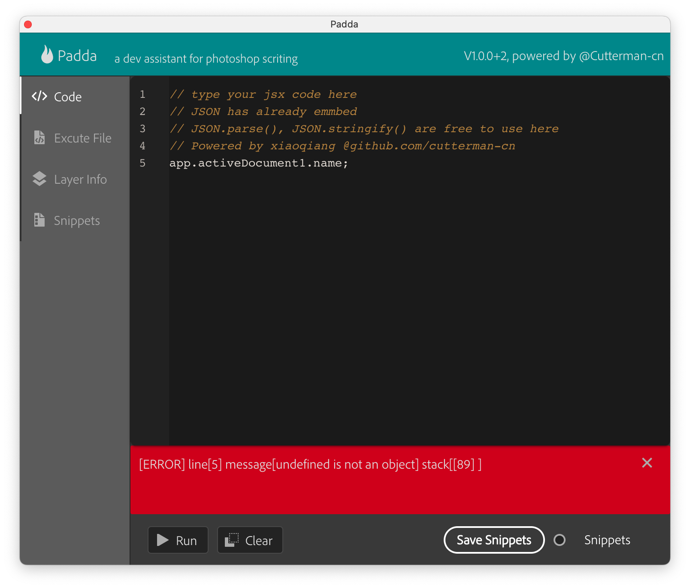
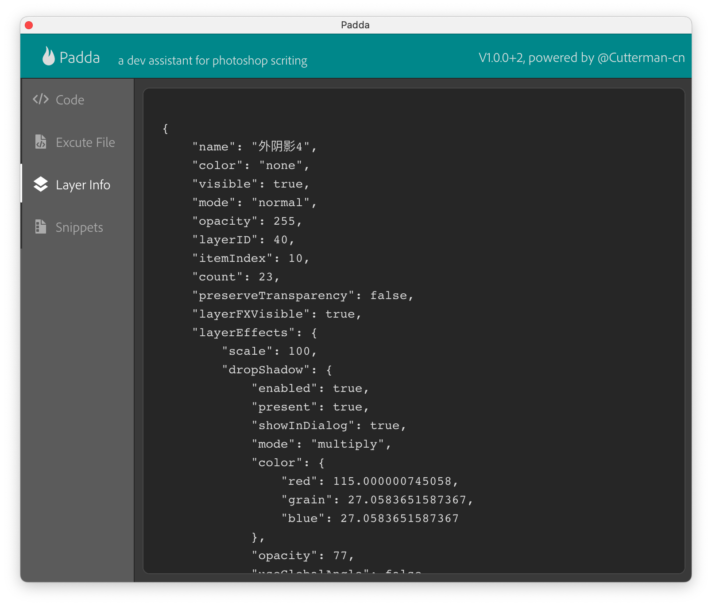

# Padda

[中文介绍](./README-CN.md)

A plugin panel where you can coding JSX script.

when scripting in Photoshop, we always need to test our jsx code to see if works or not. We use Adobe Extension Toolkit to do it, But it's not supported on latest mac OS. 

So I made a plugin to help plugin development

## Features

### 1. script coding

embeded code editor in which you can put your JSX code and run. execution result are displayed in the output field.

and when error occurs, you can see exception detail in the output field.

> notce: debug is not implemented!

### 2. execute local file

you can quickly execute a jsx file on disk, without using File -> Script -> Select...

### 3. Layer Info detect

when selected a layer, it shows the layer information in JSON format

### 4. Snippets

easy way to manage your code snippet, you can save your code and use in future.

## Usage

download latest release from [release page](https://github.com/cutterman-cn/padda/releases)

unzip the installer zip and double click to install

after installation complete, restart your photoshop and open the panel from Window -> Extensions -> Padda - devtool

## Suggestion & Issue

if meet any problem, or you have new good idea, please report an issue.

enjoy!